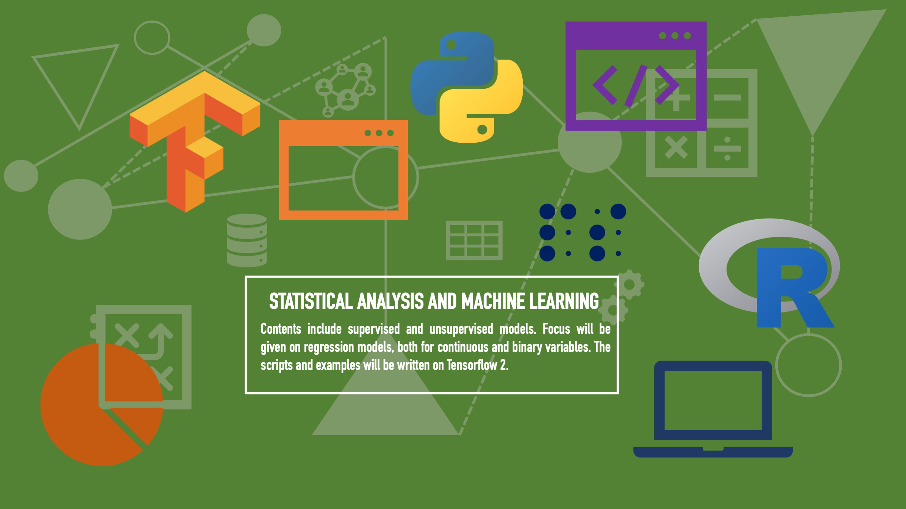

# Statistical Analysis and Machine Learning

## Supervised Learning

### Linear Regression

Sources: 

1. [The Elements of Statistical Learning](https://web.stanford.edu/~hastie/ElemStatLearn/)
2. [An Introduction to Statistical Learning: With Applications in R](http://faculty.marshall.usc.edu/gareth-james/ISL/)

Folder: Regression Methods

Similarly to almost any statistical model, linear regression assumes a matrix of inputs $X$ with $X \in \mathbb{R}^{n \times d}$, $n$ being the number of observations and $d$ being the number of dimensions in the dataset. 

As an example  
